# SPANISH WORD GAME


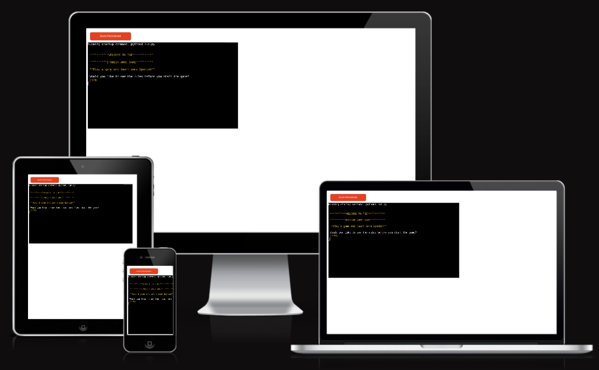


## Welcome to the Spanish Word Game

This is a game written in the Python programming language, it is a terminal-based language word game. Its main purpose is to aid in the learning of new Spanish words while playing a game. Adding competitiveness, and gaming aspects to learning. It helps to increase general vocabulary knowledge, not testing on the specifics of grammar.

A perfect tool for language schools to add to their curriculum. Giving their students some light relief from traditional learning techniques, and a simple way to introduce them to new vocabulary and test what has already been taught. With an easily edited word list, to update for students at different stages of their education.
Also, easily edited into other languages.


It is aimed at anyone of any age starting to learn Spanish as a new language. Ideal for kids, once they are of reading and writing ages, with the bonus of improving their typing skills, or even as their first introduction to hard typing. As it is a terminal-based game the display output and styling are minimalist and simple. This leaves it equally appealing to adults of all ages.

The gameplay is straightforward. The user is asked if they want to see the rules of the game before the game begins. Once the user decides to start the game, they are asked what difficulty level they want to play. With two levels easy or hard, easy being short simple well-known words and hard being longer less well-known words. With the difficulty level chosen, the game will begin. A Spanish word is shown, and the user is prompted to type the English translation. Users will be told if correct or incorrect, with the translation shown for the incorrect guesses. Once the user scores 20 points or gets 3 incorrect answers the game ends. Their score will be displayed. The next option will be to start a new game or return to the opening section.

The player is kept in a loop, with each section/page, there is a 2 option question, where the user can decide what to do next by typing a single letter. Creating a simply navigated game with a clear path through.


## UX

The idea for this game is a quick word-learning game, it is simple to navigate and self-explanatory. The navigation is circular, with a very clear path through the application. Being a terminal-based game the scope for design features is limited. However, to make this as user-friendly as possible I implemented a few features, to the game.

The most obvious is colour. By importing a module called "Colorama" I was able to style specific pieces of text with colour. This helps the UX of the application, by emphasising certain information, e.g. notifying the user of a correct answer with the word "correct" in green and when wrong, "incorrect" in red. Using colour to make information clearer. Yellow, is the main colour used throughout for the title texts and input prompt text, creating a recognisable theme throughout the application.

Another two features that greatly increase the user experience is the clear terminal screen function, along with the text output delay function. This means that after every move or navigation to a different section by the user, the terminal screen will clear. This prevents the terminal from becoming too overcrowded with previous arts of the game. Then as the terminal is re-populated with the output text of the new section, it is printed with different delay times. 

Each section is finished with a question,e.g "do you want to start a new game", or "do you want to see the game rules". These are all 2 option questions, with a click of a single letter key and pressing enter, the decision is made. Quick navigations and delayed text printing, helps create a nice flow to the game with an easy user interface.

Few distractions, clean look in the terminal and simple intructions all add to an efficient UX, perfect for an educational tool/game.

## Features

### Existing Features

- **Start Game**

    - Here is where the application begins. The title and subtitle, appear one after the other with a short delay between them. Finally showing a question, asking the user if they would like to see the rules before beginning the game. This is a Y/N question, that prompts the user to type Y or N for yes or no. If Y is typed the terminal is cleared, and the rules function is called. If N is typed the terminal is cleared, and the difficulty function is called.

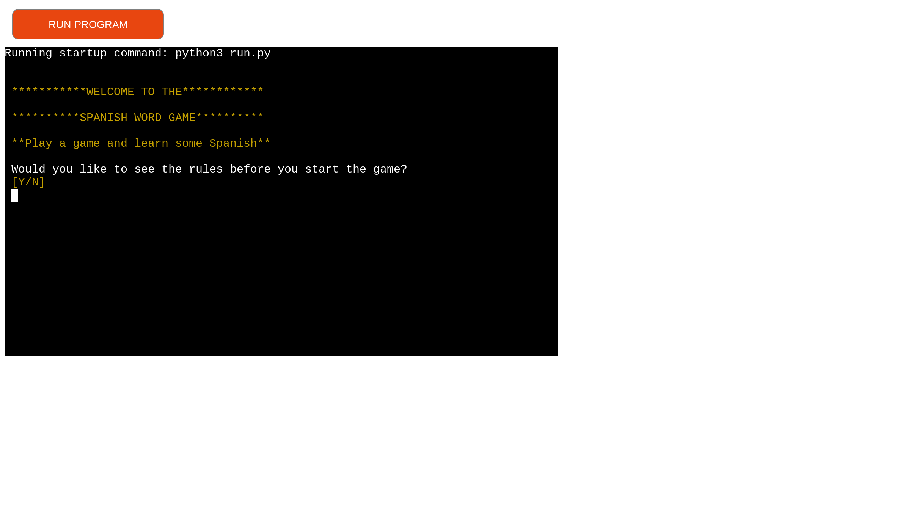

- **Game Rules**

    - If the player chooses to see the rules, the cleared terminal shows the game title, with a delay, then a list of the game rules followed by a question after. This question is also Y/N. Controlled by the question function. They are asked if they are ready to start a game. Y will call the difficulty function, while N will call back to the start_game function.

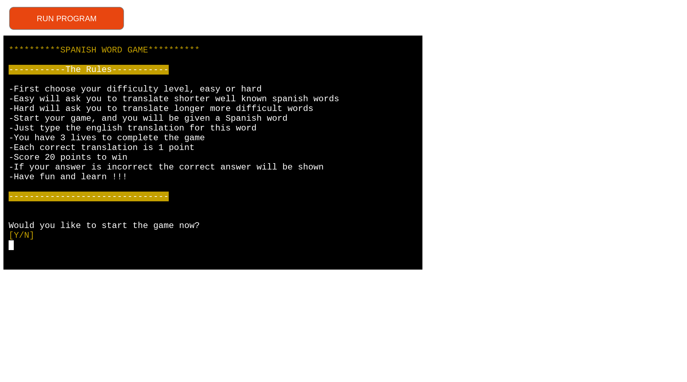

- **Difficulty Level**

    -Here the player is asked what difficulty level they would like to play, easy or hard. This also has a delay applied to the printing of the output text. This question is answered with the keys E or H, for easy or hard. Both options call the main game function but with the parameter of what level is chosen.


- **Main game**

    - This is where the main logic of the game takes place. The user is notified what level they chose, and told the game is beginning. After a delay, the terminal is cleared again and the lives counter and score counter are printed to the top of the terminal, and stay there while the game is in progress, being updated as the game continues. The first Spanish word is printed. The user then types the translation, and presses enter. If correct the word correct is printed in green and the counters are updated. If incorrect the word incorrect, is printed in red, and the correct answer is also printed. there is a delay and then the terminal is cleared bar the counters, and a new word is printed. The correct answer when the user is incorrect is displayed longer before the terminal is cleared to give them a chance to read and note the correct answer. This game logic continues in a while loop, until either the score reaches 20 or the lives counter goes below 0, by getting 3 wrong answers. The finished function is then called.

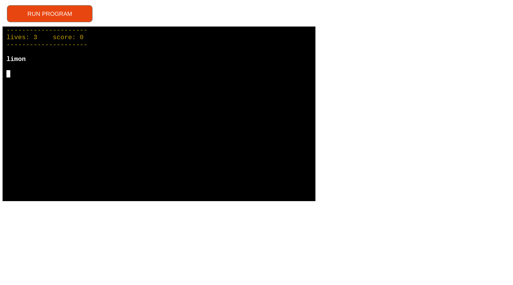
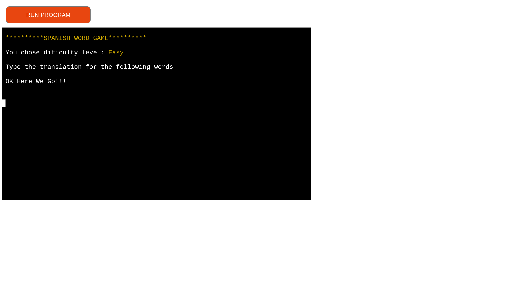
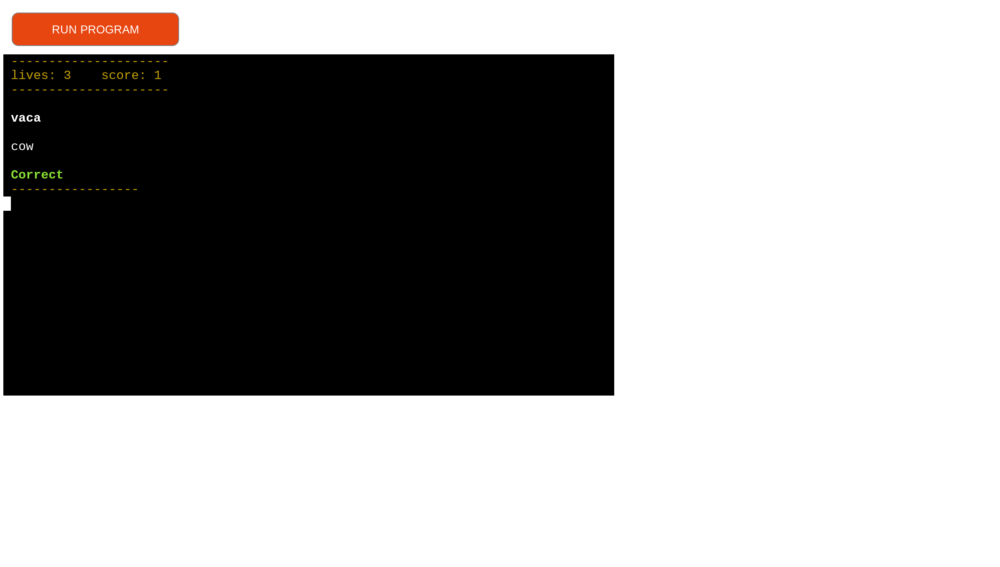


- **Finished game**

    - This function takes the parameters of the game class (score and lives), to deal with the decision of whether the player has won or lost, which then calls the win or lose game functions. These then print the won or lost statements and show the stats of the game, using the game class again. Both outcomes will then prompt the user to either start a new game or return to the very beginning of the application, with another Y/N question.

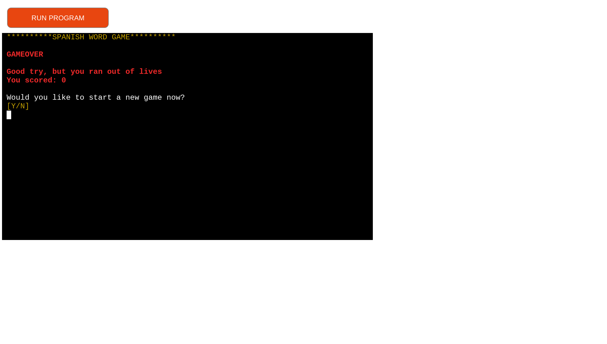
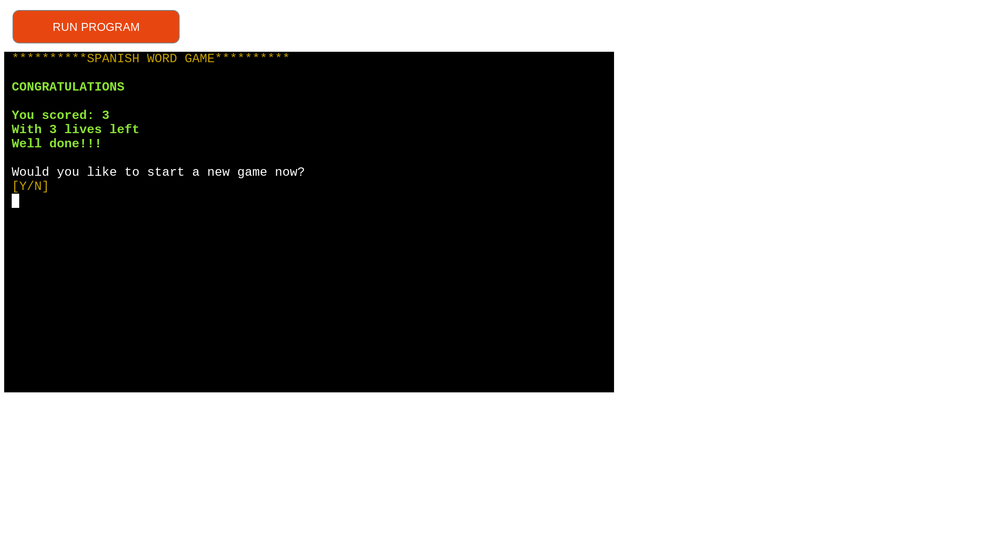

- **Score and Lives Counters**

    - The score and lives stats of the current game is stored, controlled, and passed to other functions by the game class. Throughout the gameplay, these numbers are displayed at the head of the terminal and updated after each answer.

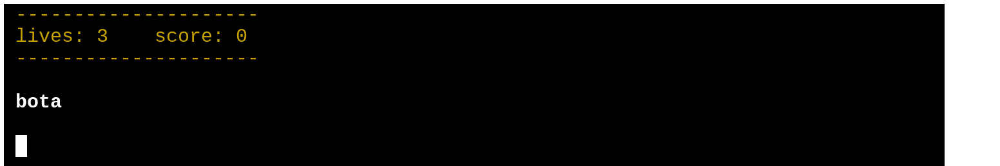

- **Question Function**

    - This function was built to deal with nearly all the questions that prompted the user to answer throughout the game. Its purpose is to reduce the amount of repetition of code. Any Y/N question is performed by this one function. the function is called with parameters, that tell the function what other functions to call depending on the answer of the user. This greatly helped to refactor the code, in all the other functions.

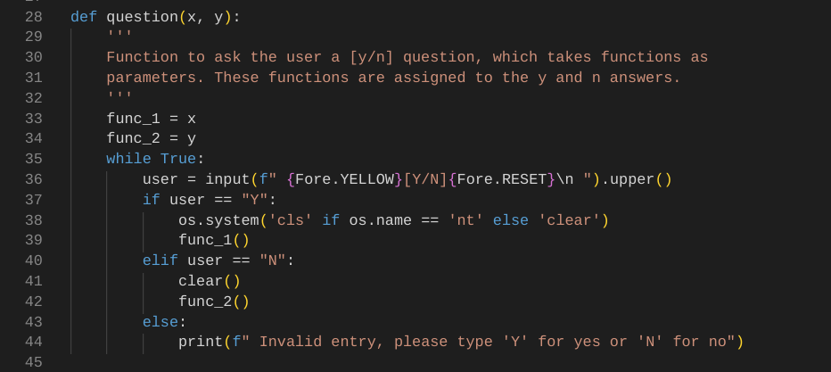

- **Game Class**

    - This class was built to globally handle the scores and lives counters, in the game. Allowing me to pass these stats to different areas in the code. Again helping to reduce the amount of code and repetition throughout the run.py file.

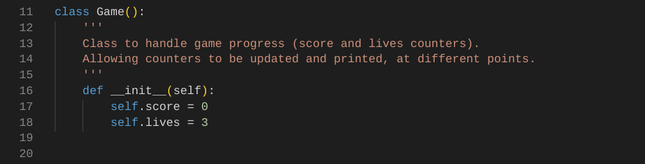

- **Difficulty Level**

    - This area is where the user decides what game level they want to play at. The terminal prints the question, giving two options, selected by typing one of two letters. "E" for easy or "H" for hard. Like all the other user inputs in the application, only these two letters will advance the player, any other letters, characters or keys will print a message, notifying them that the input was invalid.


- **Words lists**

    - In the words.py file, I have two lists of words stored, one for the easy level and one for the hard level. These are accessed by the main_game function, to pull a Spanish word to display and a matching English word to compare to the user's answer. The lists of words are stored as a list of dictionaries. This allows the function to access the word pairs by using their dictionary key: value sets. 
    They have been left to easily edit and add to. When the word lists are being called on, I have the main_game function make a duplicate/copy of the list, randomly shuffle the list, and then remove one dictionary for each question/translation to the player. They are being removed from the copied list with the pop() method, making sure no words are being repeated during one game.

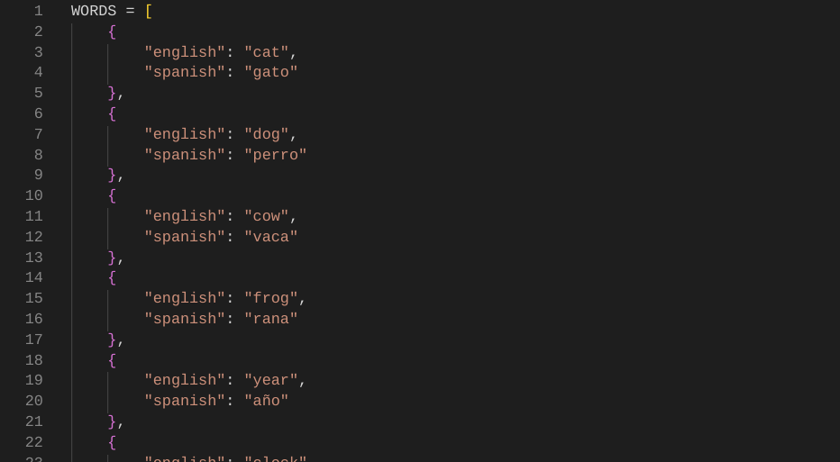

### Future Features

Below is a list of some future features that could be implemented to the application.

- Additional lists of words
    - In the future extra word lists can be added. Either to just have more words to teach the user or an extra difficulty level of words.
- Catogaories of words
    - Another idea is having more groups of words, divided by catagories. the user could pick to test themselves on words from a food catagory, or travel etc. Specialisiing the learning.
- Reverse eglish to spanish
    - Another idea is to reverse what the user sees and has to type. Currently the game shows the spanish word and asks for the english translation. The english could be shown and the spanish has to be typed.

## Tools & Technologies Used

- [Python](https://www.python.org) used as the main programming language in this project.
- [Git](https://git-scm.com) used for version control. (`git add`, `git commit`, `git push`)
- [GitHub](https://github.com) used for secure online code storage.
- [Gitpod](https://gitpod.io) used as a cloud-based IDE for development.
- [Markdown Builder by Tim Nelson](https://traveltimn.github.io/markdown-builder) used to help generate the Markdown files.
- [Heroku](https://www.heroku.com) used for hosting the deployed back-end site.


## Data Model

To follow best practice, a flowchart was created for the app's logic, and mapped out, using a free version of
[Lucidchart](https://lucid.app/lucidchart/0e9e3ef0-01d8-444c-8553-dcd4a8875a21/edit?viewport_loc=-229%2C-83%2C2534%2C1213%2C~sHFGmMXijPm&invitationId=inv_962ddae8-7fa3-4339-a72a-04553bd402a6) 

Below is the flowchart of the main process of this Python program. It shows the entire cycle of the program.

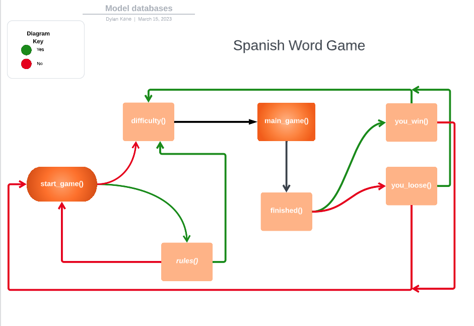

### Classes & Functions

The program uses one class to handle game progress, (the score and lives counters), allowing them to be updated at different stages troughout the code

```python
class Game():
    '''
    Class to handle game progress (score and lives counters).
    Allowing counters to be updated and printed, at different points.
    '''
    def __init__(self):
        self.score = 0
        self.lives = 3

```

The primary functions used on this application are:

- `question()`
    - Function to ask the user a y/n question, which takes functions as parameters. These functions are then called depending on the users answer, leading them to different places. This way the code doesn't have to be repeated every time the user is asked a question to get to the next step.

- `start_game()`
    - Function to ask user if they are ready to start the game, or want to see the set of game rules.
- `rules()`
    - Holds print statements for game rules,for user to read. Asks user for input to direct them to the game
- `difficulty()`
    - Function that leads to main game function. Checks what difficulty level user wants to play game at.
- `main_game()`
    - Creates duplicate list of the specific words list from words.py, picked at the difficulty function and shuffles it. Removes a dictionary from the list. Prints out the spanish word. Prompts the user to translate it and compare their answer to the matching english word. Updates game class, to determine the end of game.
- `finished()`
    - Function that takes the game class as an argument to decide when game ends, where to send them, to the you_win() or you_lose() functions
- `you_win()`
    -  Function to handle when the user completes the game. Displays, score and lives. Directs them back to the game.
- `you_lose()`
    - Function to handle when the user runs out of lives. Displays scores, and
    directs them back to the game.

- `clear()`
    - Function to clear terminal screen, to be called at multiple points.

- `question()`
    - Function to ask the user a y/n question, which takes functions as parameters. These functions are then called depending on the users answer, leading them to different places. This way the code doesn't have to be repeated every time the user is asked a question to get to the next step.

### Imports

I've used the following Python packages and/or external imported packages.

- `time`: used for adding time delays to text outputs
- `copy`: used for creating a shuffled list of words, to prevent words being repeated in game
- `random`: used to get a random randomly shuffle word list
- `os`: used for adding a `clear()` function, to clear the terminal screen
- `colorama`: used for including color in the terminal

## Testing

For all testing, please refer to the [TESTING.md](TESTING.md) file.

## Deployment

Code Institute has provided a [template](https://github.com/Code-Institute-Org/python-essentials-template) to display the terminal view of this backend application in a modern web browser.
This is to improve the accessibility of the project to others.

The live deployed application can be found deployed on [Heroku](https://spanish-word-game.herokuapp.com).

### Heroku Deployment

This project uses [Heroku](https://www.heroku.com), a platform as a service (PaaS) that enables developers to build, run, and operate applications entirely in the cloud.

Deployment steps are as follows, after account setup:

- Select **New** in the top-right corner of your Heroku Dashboard, and select **Create new app** from the dropdown menu.
- Your app name must be unique, and then choose a region closest to you (EU or USA), and finally, select **Create App**.
- From the new app **Settings**, click **Reveal Config Vars**, and set the value of KEY to `PORT`, and the value to `8000` then select *add*.
- If using any confidential credentials, such as CREDS.JSON, then these should be pasted in the Config Variables as well.
- Further down, to support dependencies, select **Add Buildpack**.
- The order of the buildpacks is important, select `Python` first, then `Node.js` second. (if they are not in this order, you can drag them to rearrange them)

Heroku needs two additional files in order to deploy properly.
- requirements.txt
- Procfile

You can install this project's **requirements** (where applicable) using:
- `pip3 install -r requirements.txt`

If you have your own packages that have been installed, then the requirements file needs to be updated using:
- `pip3 freeze --local > requirements.txt`

The **Procfile** can be created with the following command:
- `echo web: node index.js > Procfile`

For Heroku deployment, follow these steps to connect your own GitHub repository to the newly created app:

Either:
- Select **Automatic Deployment** or **Manual Deployment** from the Heroku app.

Or:
- In the Terminal/CLI, connect to Heroku using this command: `heroku login -i`
- Set the remote for Heroku: `heroku git:remote -a app_name` (replace *app_name* with your app name)
- After performing the standard Git `add`, `commit`, and `push` to GitHub, you can now type:
	- `git push heroku main`

The frontend terminal should now be connected and deployed to Heroku!

### Local Deployment

This project can be cloned or forked in order to make a local copy on your own system.

For either method, you will need to install any applicable packages found within the *requirements.txt* file.
- `pip3 install -r requirements.txt`.

If using any confidential credentials, such as `CREDS.json` or `env.py` data, these will need to be manually added to your own newly created project as well.

#### Cloning

You can clone the repository by following these steps:

1. Go to the [GitHub repository](https://github.com/dylankane/spanish-word-game) 
2. Locate the Code button above the list of files and click it 
3. Select if you prefer to clone using HTTPS, SSH, or GitHub CLI and click the copy button to copy the URL to your clipboard
4. Open Git Bash or Terminal
5. Change the current working directory to the one where you want the cloned directory
6. In your IDE Terminal, type the following command to clone my repository:
	- `git clone https://github.com/dylankane/spanish-word-game.git`
7. Press Enter to create your local clone.

Alternatively, if using Gitpod, you can click below to create your own workspace using this repository.

[](https://gitpod.io/#https://github.com/dylankane/spanish-word-game)

Please note that in order to directly open the project in Gitpod, you need to have the browser extension installed.
A tutorial on how to do that can be found [here](https://www.gitpod.io/docs/configure/user-settings/browser-extension).

#### Forking

By forking the GitHub Repository, we make a copy of the original repository on our GitHub account to view and/or make changes without affecting the original owner's repository.
You can fork this repository by using the following steps:

1. Log in to GitHub and locate the [GitHub Repository](https://github.com/dylankane/spanish-word-game)
2. At the top of the Repository (not top of page) just above the "Settings" Button on the menu, locate the "Fork" Button.
3. Once clicked, you should now have a copy of the original repository in your own GitHub account!

### Local VS Deployment

The only notable difference between the local and live version of this application that I am aware of, is the colours. The live deployed version seems to have rendered the colours darker and duller than the local version I developed. It doesn't seem to have any effect on the UX. 

## Credits

| Source | Location | Notes |
| --- | --- | --- |
| [Markdown Builder by Tim Nelson](https://traveltimn.github.io/markdown-builder) | README and TESTING | tool to help generate the Markdown files |
| [YouTube/Tech With Tim](https://www.youtube.com/watch?v=u51Zjlnui4Y) | entire application / coloured text | Tutorial on how to use the colorama module on a python project |
| [geeks for geeks](https://www.geeksforgeeks.org/clear-screen-python/) | entire application / clearing terminal screen | Used to build a function, that clears the terminal  |
| [Stack Overflow](https://stackoverflow.com/questions/2084508/clear-terminal-in-python) | entire application / clearing terminal screen | Used to build a function, that clears the terminal |
| [w3 Schools](https://www.w3schools.com/python/ref_random_shuffle.asp) | main_game | Used to shuffle word list |
| [Tim Nelson](https://traveltimn.github.io) | main_game() | Tim helped me with the code to create a copy of the list, allowing it to be shuffled and a dictionary removed one by one for the game. Keeping the original list un-touched "word_list = copy.deepcopy(list)" |
| [Tim Nelson](https://traveltimn.github.io) | words.py | Tim helped me with the code to create a bank of words by using a list of dictionaries
| [Digital Ocean](https://www.digitalocean.com/community/tutorials/python-time-sleep) | entire application | code that allows the delay of text output being displayed to the terminal

### Acknowledgements

- I would like to thank my Code Institute mentor, [Tim Nelson](https://traveltimn.github.io) for his support and advice throughout the development of this project.
- I would like to thank the [Code Institute](https://codeinstitute.net) tutor team for their assistance with troubleshooting.
- I would like to thank the [Code Institute Slack community](https://code-institute-room.slack.com) for the moral support.
- I would like to thank my partner (Isabel), all the support and for helping with the spanish translations.
