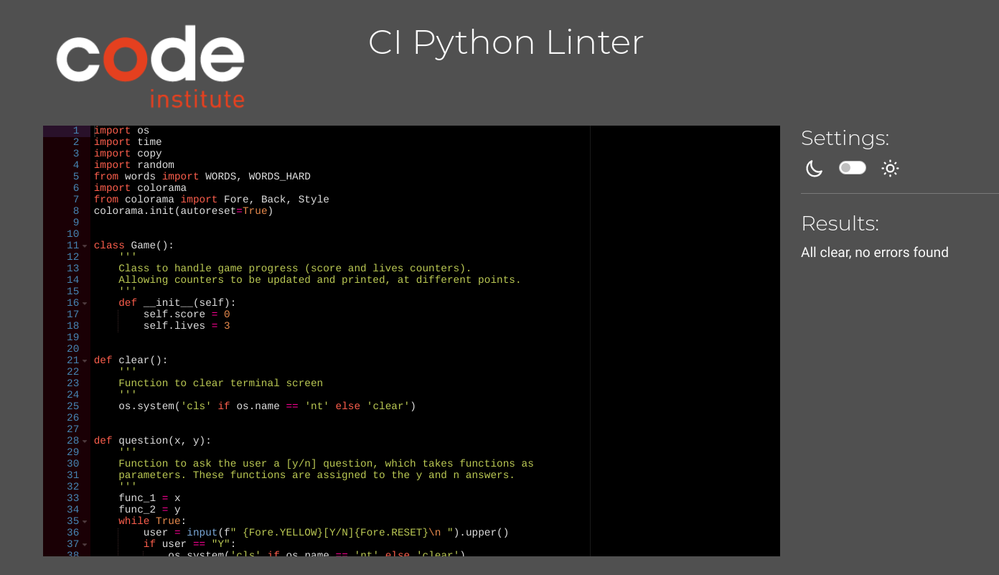

# Testing

Return back to the [README.md](README.md) file.

Here is all the testing I have put the application through and the results of these tests.

## Code Validation

### Python

I have used the recommended [CI Python Linter](https://pep8ci.herokuapp.com) to validate all of my Python files.

| File | CI URL | Screenshot | Notes |
| --- | --- | --- | --- |
| run.py | [CI PEP8](https://pep8ci.herokuapp.com/https://raw.githubusercontent.com/dylankane/spanish-word-game/main/run.py) |  | All clear, no errors found |
| words.py | [CI PEP8](https://pep8ci.herokuapp.com/https://raw.githubusercontent.com/dylankane/spanish-word-game/main/words.py) |  | All clear, no errors found |

## Lighthouse Audit

I've tested my deployed project using the Lighthouse Audit tool to check for any major issues.

| Page | Size | Screenshot | Notes |
| --- | --- | --- | --- |
| Spanish Word Game | large monitor |  | Slightly lower than optimal on the SEO category |
| Spanish Word Game | Laptop |  | Same issue with SEO |
| Spanish Word Game | tablet |  | Same issue with SEO |

## Defensive Programming

Defensive programming was manually tested with the below user acceptance testing:

| Section | User Action | Expected Result | Pass/Fail |
| --- | --- | --- | --- |
| Start Game | | | |
| | Type "Y" | Redirection to game rules | Pass |
| | Type "N" | Redirection to difficulty choice | Pass |
| | Type neither Y/N or type non letter key | Invalid entry message, ask user to answer again | Pass |
| Rules | | | |
| | Type "Y" | Redirection to difficulty choice | Pass |
| | Type "N" | Redirection back to start game | Pass |
| | Type neither Y/N or type non letter key | Invalid entry message, ask user to answer again | Pass |
| Difficulty level | | | |
| | Type "E" | Redirection to main game with easy level choosen | Pass |
| | Type "H" | Redirection to main game with hard level choosen | Pass |
| | Type neither E/H or type non letter key | Invalid entry message, ask user to answer again | Pass |
| Main Game | | | |
| | Type translation | Correct | Pass |
| | Type translation | Incorrect  | Pass |
| Win game | | | |
| | Type "Y" | Redirection to main game | Pass |
| | Type "N" | Redirection back to start game | Pass |
| | Type neither Y/N or type non letter key | Invalid entry message, ask user to answer again | Pass |
| Loose game | | | |
| | Type "Y" | Redirection to main game | Pass |
| | Type "N" | Redirection back to start game | Pass |
| | Type neither Y/N or type non letter key | Invalid entry message, ask user to answer again | Pass |

## Browser Compatibility

I have tested the deployed application on 3 browsers to check for compatibility. Below are the results.

| Browser | Screenshot | Notes |
| --- | --- | --- |
| Chrome |  | All working as expected |
| Firefox |  | All working as expected |
| Edge |  | All working as expected |

## Bugs

While developing this project I came up against a few issues and bugs, below is a list of the some issues I had.

- While loop in the game. This piece of code threw up a few different issues/ bugs while I was developing it. When first written I had created an infinite loop by not having an condition to break or stop it. I also had a problem getting the conditions to end it at the right points. Also calling the spanish word to be displayed caused issues. It went through a few different stages of eveolution until finally getting it all to work correctly. Finished product below.

    ```python
        game = Game()
        word_list = copy.deepcopy(list)
        random.shuffle(word_list)

        while game.lives > 0 and game.score < 20:
            word = word_list.pop(0)
            english_word = word['english']
            spanish_word = word['spanish']
            print(f" {Fore.YELLOW}---------------------")
            print(f" {Fore.YELLOW}lives: {game.lives}    score: {game.score}")
            print(f" {Fore.YELLOW}---------------------\n")
            print(f" {Style.BRIGHT}{spanish_word}")
            answer = input(f"\n ").lower()
            if answer == english_word:
                game.score += 1
                print("")
                print(f" {Fore.GREEN}{Style.BRIGHT}Correct")
                print(f" {Fore.YELLOW}-----------------")
                time.sleep(2)
                clear()
            else:
                game.lives -= 1
                print("")
                print(f" {Fore.RED}{Style.BRIGHT}Incorrect")
                print(f" {Fore.YELLOW}The answer is {Fore.RESET}{english_word}")
                print(f" {Fore.YELLOW}-----------------")
                time.sleep(2.5)
                clear()

        finished(game)
    ```

    - To fix this, I put the condition of the while loop in the while statement at the beginning, and realised that I didnt need ">=" and only needed ">" to get the break points of the while loop to stop at the right places. Called the spanish word from the list from within the while loop but kept the creating of the list copy and shuffle outside the while loop.


- Y/N. For the many questions that looked for an answer of either of two letters to be typed. It didnt work with lower case letters. As I had checked the user input against a capital letter. I wnted this to work for both upper and lowe case letters.

    ```python
    while True:
            user = input(f" {Fore.YELLOW}[Y/N]{Fore.RESET}\n ").upper()
            if user == "Y":
                os.system('cls' if os.name == 'nt' else 'clear')
                func_1()
            elif user == "N":
                clear()
                func_2()
            else:
                print(f" Invalid entry, please type 'Y' for yes or 'N' for no")


    ```

    - To fix this, I added a .upper() method to the user input field, tranforming all the input to upper case. I then used this method for all user input in the application, includeing in the main game, but here i used the .lower() method as all the words in the list are in lowercase.

- Pathways from one function to another

    - To fix this I

- Line too long. This was a reccurring issue/bug with the print statements in particular. With a max of 80 characters I found the output text exceeded this maximum often.
    

    - To fix this, I had to split the text into different print statements and add new lines.


## Unfixed Bugs / Issues

- One issue outstanding is in the main game play, where the user has to type the english translation of the word displayed. It currently just checks to see if the answer is right or wrong. I have not yet implemented an error check when the player types a non leter key. To have a message telling them that is not valid and possibly a typo, giving them a chance to retry that word, without being marked as inncorect.

    - Attempted fix: I tried to use the "isalpha()" method to check if the answer is only alphabetic entries 


There are no remaining bugs that I am aware of.
